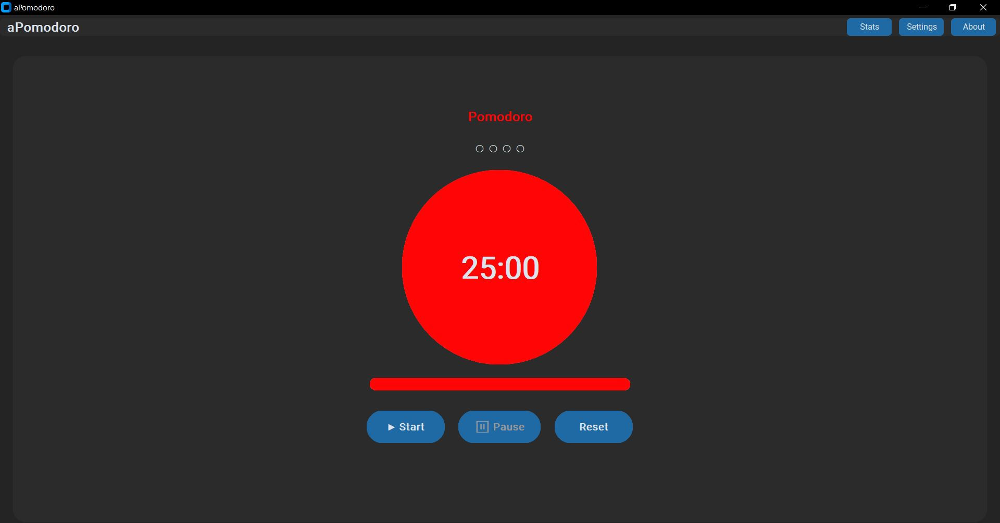
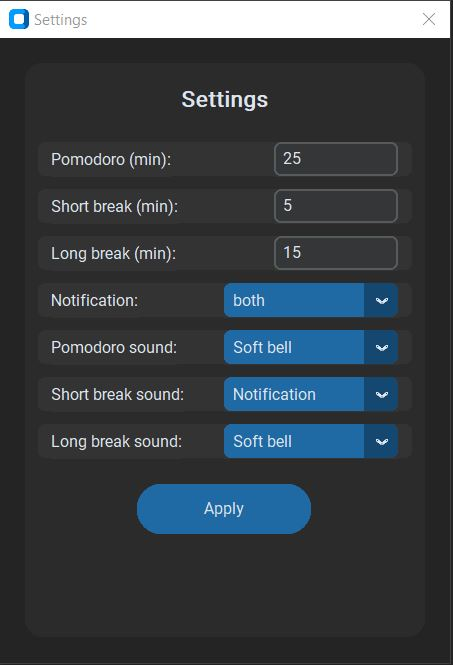
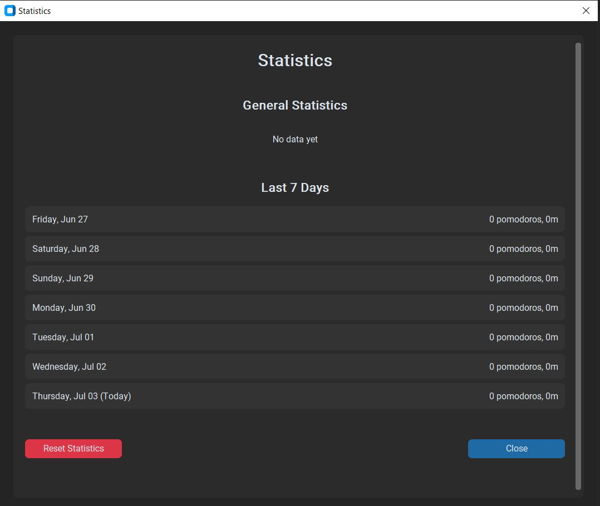

# 🍅 aPomodoro


**aPomodoro** - это современное приложение для управления временем по технике Pomodoro. Помогает повысить продуктивность через циклы работы и отдыха.

## ✨ Особенности

- 🕐 **Классическая техника Pomodoro**: 25 минут работы, 5 минут короткий перерыв, 15 минут длинный перерыв
- 🔧 **Настраиваемое время**: Измените продолжительность по своим потребностям
- 🔊 **Звуковые уведомления**: Выбор из различных мелодий или отключение звуков
- 📊 **Статистика**: Отслеживание выполненных помодоро и времени работы
- 🎨 **Современный интерфейс**: Темная тема с красивыми переходами
- 💾 **Cохранение**: Настройки и статистика сохраняются при следующем запуске

## 📸 Скриншоты
### 🍅 Главное окно

### ⚙️ Окно настроек

### 📊 Окно статистики


## 🚀 Установка

Выберите один из двух способов установки:

### 📦 Вариант 1: Готовый файл .exe


####   👉 Скачайте файл: [aPomodoro.exe](https://disk.yandex.ru/d/12Gv3-eJdAZ4Cg "Скачать")


### 👨‍💻 Вариант 2: Установка из исходного кода

**Для разработчиков и продвинутых пользователей:**

#### Шаг 1: Клонирование репозитория
```bash
# Клонируем репозиторий
git clone https://github.com/Archi-861/aPomodoro.git
```

#### Шаг 2: Создание виртуального окружения
```bash
# Создаем виртуальное окружение
python -m venv venv

# Активируем его
# Windows:
venv\Scripts\activate
```

#### Шаг 3: Установка зависимостей
```bash
# Устанавливаем требуемые пакеты
pip install -r requirements.txt
```

#### Шаг 4: Запуск приложения
```bash
# Запускаем приложение
python main.py
```

## 🎯 Быстрый старт

### После установки:

1. **Запустите aPomodoro**
2. **Настройте время** (опционально):
   - Нажмите **Settings**
   - Измените продолжительность помодоро, перерывов
   - Выберите звуки уведомлений
3. **Начните работу**:
   - Нажмите **▶ Start**
   - Работайте 25 минут
   - Наслаждайтесь перерывом!

### Принцип работы:
```
🍅 Помодоро (25 мин) → ☕ Короткий перерыв (5 мин) → 
🍅 Помодоро (25 мин) → ☕ Короткий перерыв (5 мин) → 
🍅 Помодоро (25 мин) → ☕ Короткий перерыв (5 мин) → 
🍅 Помодоро (25 мин) → 🏖️ Длинный перерыв (15 мин) → ♻️ Повтор
```

---

## ⚙️ Настройки

### Доступные настройки:
- **⏰ Время работы**: 1-60 минут (по умолчанию 25)
- **☕ Короткий перерыв**: 1-30 минут (по умолчанию 5)  
- **🏖️ Длинный перерыв**: 1-60 минут (по умолчанию 15)
- **🔊 Звуки**: Bell, Soft Bell, Notification, Bonus 1, Bonus 2, No sound
- **📢 Уведомления**: Sound, Popup, Both

### Как изменить настройки:
1. Нажмите кнопку **Settings** в главном окне
2. Измените нужные параметры
3. Нажмите **Apply**
4. Настройки сохранятся автоматически

---

## 📊 Статистика

### Что отслеживается:
- **📈 Общее количество помодоро**
- **⏱️ Общее время работы**
- **📅 Статистика по дням**
- **📊 Среднее количество помодоро в день**

### Как посмотреть статистику:
1. Нажмите **Stats** в главном окне
2. Изучите данные за последние 7 дней
3. При необходимости сбросьте статистику
---

### 🛠️ Используемые технологии:
- **🐍 Python** - основной язык программирования
- **🖼️ CustomTkinter** - современная GUI библиотека
- **🔊 Pygame** - воспроизведение звуков
- **🧾 JSON** – хранение настроек и статистики
- **🔔 win10toast** – всплывающие уведомления


